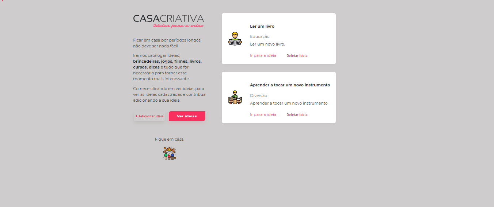
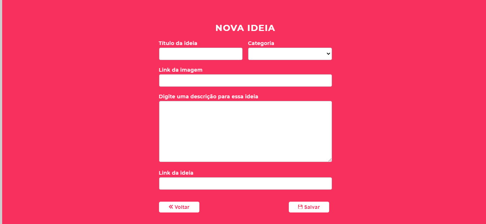
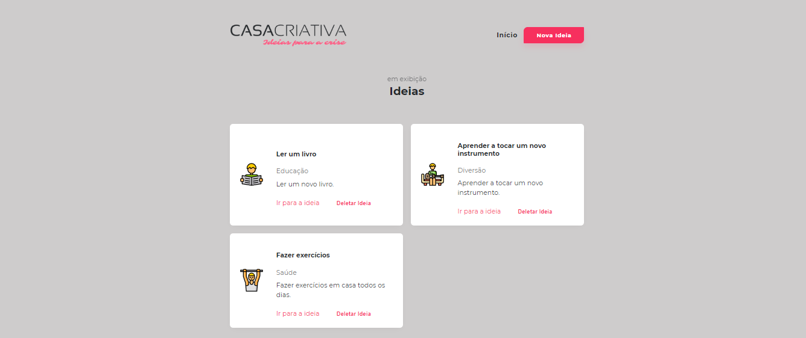

<h1 align="center">

</h1>

<h1 align="center"> WorkshopDev </h1>

---
## Índice
- [Sobre](#-sobre)
- [Projeto](#-projeto)
- [Imagens](#-imagens)
- [Tecnologias](*-tecnologias)

---
### Sobre
O projeto consistiu de uma aplicação chamada CasaCriativa, nesta aplicação o usuário podia cadastrar e listas ideias para atividades que gostaria de desenvolver durante a quarentena. O projeto foi desenvolvido durante o WorkshoDev da [Rocketseat](https://rocketseat.com.br/), sob mentoria do Mayk Brito.

---
### Projeto

A primeira etapa do projeto foi a criação da página inicial, contendo as duas últimas ideias cadastradas.

Na página inicial era possível ir para página de cadastrar uma nova ideia.

E também era possível ir para página contendo todas as ideias cadastradas.

No projeto foi desenvolvido tanto o front-end quanto o back-end da aplicação.

### Imagens
As imagens deste projeto foram obtidas dos seguintes sites:

- Icons made by <a href="https://www.flaticon.com/authors/catkuro" title="catkuro">catkuro</a> from <a href="https://www.flaticon.com/" title="Flaticon"> www.flaticon.com</a>
- <a target="_blank" href="https://icons8.com.br/icons/set/save">Salvar icon</a> ícone por <a target="_blank" href="https://icons8.com.br">Icons8</a>
- <a target="_blank" href="https://icons8.com.br/icons/set/back">Voltar icon</a> ícone por <a target="_blank" href="https://icons8.com.br">Icons8</a>

---

### Tecnologias
Para reaização deste projeto foram utilizadas inúmero tecnoloias e ferramentas, das quais se destacam:
- HTML
- CSS
- Javascript
- NodeJs
- Nunjucks
- Express

---
Projeto desenvolvido por [Camila Diniz](https://github.com/CamilaDiniz2) durante a semana WorkshopDev da [Rocketseat](https://rocketseat.com.br/).